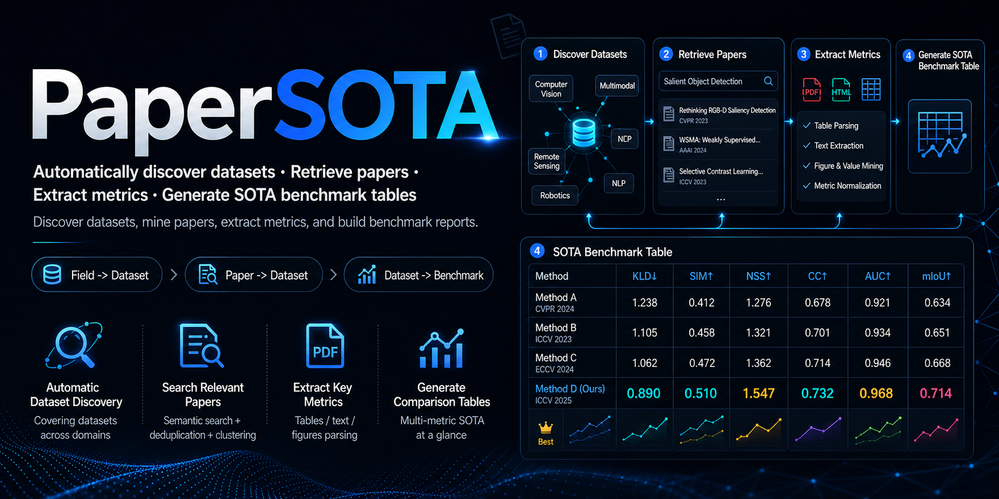

# PaperSOTA

English | [中文](README.md)



PaperSOTA is a dataset-centric Skill and CLI scaffold for surveying papers, algorithms, and SOTA metrics. It starts from a research field, a paper title/link, or an explicit dataset name, then organizes dataset verification, related paper discovery, metric extraction, and Markdown SOTA report generation.

The default report language is Chinese while table headers and metric names remain in English. If the user asks entirely in English or explicitly requests English, PaperSOTA should generate the report in English.

## Features

- Classifies input as `field`, `paper`, or `dataset`.
- Discovers 3-5 authoritative datasets from a research direction.
- Extracts datasets from paper titles, links, or local paper content.
- Verifies dataset identity, aliases, official pages, benchmark pages, and introducing papers.
- Searches candidate papers through OpenAlex, Semantic Scholar, Crossref, arXiv, paper pages, and benchmark pages.
- Extracts metrics from accessible HTML, PDF full text, and benchmark tables when possible.
- Generates Markdown reports with metric explanations, bolded best scores, numbered references, and limitations.
- Keeps intermediate artifacts such as `input_classification.json`, `datasets.json`, `papers.json`, `metrics.json`, and `notes.md` for manual review.

## PaperSOTA Workflow

```text
+-------------------+      +----------------------+      +----------------------+
| User input        | ---> | Input classification | ---> | Workflow routing     |
| field / paper /   |      | field / paper /      |      | discover / extract / |
| dataset           |      | dataset              |      | verify               |
+-------------------+      +----------------------+      +----------------------+
                                                                  |
                                                                  v
+-------------------+      +---------------------+      +----------------------+
| Final report      | <--- | SOTA table building | <--- | Metric extraction    |
| Markdown + notes  |      | best score bolding  |      | HTML / PDF / pages   |
+-------------------+      +---------------------+      +----------------------+
                                                                  ^
                                                                  |
                           +---------------------+      +----------------------+
                           | Paper filtering     | <--- | Dataset verification |
                           | actual use only     |      | aliases / homepage   |
                           +---------------------+      +----------------------+
```

### Routing Rules

| Input type | Example | Route | Default output |
|---|---|---|---|
| Research field | `medical image segmentation`, `LLM generation` | Discover authoritative datasets, then run the dataset workflow for each one | Multiple dataset reports |
| Paper or paper link | arXiv URL, DOI URL, OpenReview URL, paper title | Fetch or infer paper metadata, identify datasets used by the paper, then run the dataset workflow | Dataset reports related to the paper |
| Explicit dataset | `ImageNet`, `DATAXX` | Verify dataset identity, find papers that actually use the dataset, and extract metrics | Single dataset SOTA report |

## Directory Structure

```text
papersota/
|-- SKILL.md
|-- README.md
|-- README.en.md
|-- agents/
|   |-- openai.yaml
|-- images/
|   |-- PaperSOTA.png
|   |-- PaperSOTA_en.png
|-- scripts/
|   |-- papersota.py
|-- references/
|   |-- extraction-schema.md
|   |-- report-template.md
|-- examples/
    |-- example-report.md
```

## CLI Usage

### Dataset mode

```bash
python scripts/papersota.py "medical image segmentation" \
  --input-type dataset \
  --candidate-paper 100 \
  --fulltext \
  --out-dir ./papersota-medical image segmentation
```

### Field or direction mode

```bash
python scripts/papersota.py "LLM generation" \
  --input-type field \
  --max-datasets 5 \
  --candidate-paper 50 \
  --fulltext \
  --out-dir ./papersota-LLM generation
```

### Paper or paper-link mode

```bash
python scripts/papersota.py "https://arxiv.org/abs/xxxx.xxxxx" \
  --input-type paper \
  --candidate-paper 50 \
  --fulltext \
  --out-dir ./papersota-from-paper
```

### Auto classification

```bash
python scripts/papersota.py "ImageNet" \
  --candidate-paper 50 \
  --out-dir ./papersota-imagenet
```

## Output Files

The CLI writes the following files to `--out-dir`:

- `input_classification.json`: detected input type and routing decision.
- `datasets.json`: discovered or verified datasets.
- `papers.json`: candidate papers and filtering results.
- `metrics.json`: extracted metric records.
- `papersota-report-<dataset>.md`: final Markdown report.
- `notes.md`: inaccessible sources, possible false positives, protocol differences, and extraction warnings.
- `cache/`: downloaded paper pages or PDFs when `--fulltext` is enabled.

## Report Format

A final report should include at least:

1. Dataset name, aliases, and verification notes.
2. Metric explanations and directions, such as `AUC↑` and `MAE↓`.
3. Algorithm or benchmark comparison tables with the best comparable values in bold.
4. Numbered references that match the table citations.
5. Notes about inaccessible sources, possible false positives, protocol differences, and manual verification needs.

Example table:

| Paper | metrics1↓ | metrics2↑ | metrics3↑ | metrics4↓ | metrics5↑ | metricsx↑ |
|---|---:|---:|---:|---:|---:|---:|
| Model-1, CVPR2022 [1] | 1.234 | 0.345 | 0.987 | 1.001 | 0.234 | 0.678 |
| Model-., CVPR20xx [2] | 1.111 | 0.333 | 0.999 | 1.111 | 0.285 | 0.829 |
| Model-x, ICLR2025 [3] | **0.890** | **0.510** | **1.000** | **0.555** | **0.404** | **1.123** |

## Quality Checks

- Confirm dataset identity and aliases, and flag acronym collisions.
- Deduplicate papers by DOI, arXiv ID, Semantic Scholar ID, normalized title, and URL.
- Separate introducing papers, baseline papers, and later algorithm papers.
- Keep papers that actually use the dataset, not candidates that only mention it.
- Compare metrics only within the same split, protocol, and training setting.
- Write `—` for missing metrics and note `metric not found in accessible text`.

## Important Notes

PaperSOTA is an AI research assistant, not the final authority. Public APIs may miss papers, PDFs may be inaccessible or hard to parse, and some metrics may appear only in supplementary material, figures, or external leaderboards. Before publication or citation, manually verify claims against original papers, official benchmark pages, and supplementary material.

## License

MIT license.
