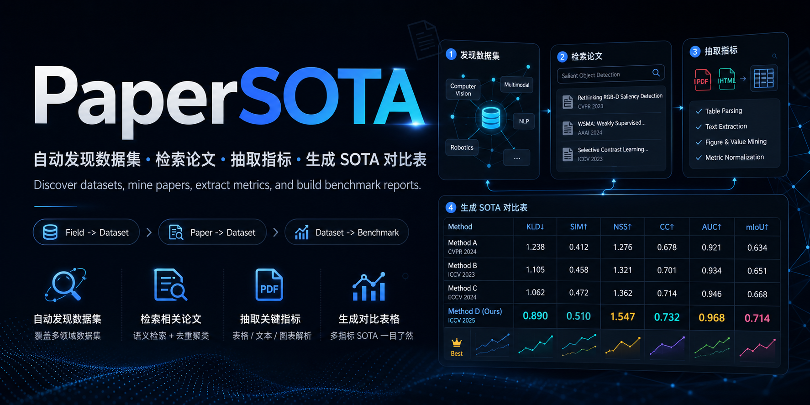

# PaperSOTA

[English](README.en.md) | 中文



PaperSOTA 是一个面向数据集的论文、算法与 SOTA 指标调研 Skill，同时提供可直接运行的 CLI 工具。它适合从研究方向、论文标题/链接或明确的数据集名称出发，自动组织数据集验证、相关论文检索、指标抽取和 Markdown 报告生成。

## 主要能力

- 输入分类：自动识别 `field`、`paper` 或 `dataset`。
- 从研究方向发现 3-5 个权威数据集。
- 从论文标题、论文链接或本地论文内容中识别使用的数据集。
- 验证数据集身份、别名、官网、benchmark 页面和引入论文。
- 通过 OpenAlex、Semantic Scholar、Crossref、arXiv、论文页和 benchmark 页检索候选论文。
- 尽量从 HTML、PDF 全文和 benchmark 表格中抽取指标。
- 生成带指标解释、最佳值加粗、编号引用和限制说明的 Markdown 报告。
- 保留 `input_classification.json`、`datasets.json`、`papers.json`、`metrics.json`、`notes.md` 等中间产物，方便人工复核。

## PaperSOTA 处理流程

```text
+-------------------+      +----------------------+      +----------------------+
| User input        | ---> | Input classification | ---> | Workflow routing     |
| field / paper /   |      | field / paper /      |      | discover / extract / |
| dataset           |      | dataset              |      | verify               |
+-------------------+      +----------------------+      +----------------------+
                                                                  |
                                                                  v
+-------------------+      +---------------------+      +----------------------+
| Final report      | <--- | SOTA table building | <--- | Metric extraction    |
| Markdown + notes  |      | best score bolding  |      | HTML / PDF / pages   |
+-------------------+      +---------------------+      +----------------------+
                                                                  ^
                                                                  |
                           +---------------------+      +----------------------+
                           | Paper filtering     | <--- | Dataset verification |
                           | actual use only     |      | aliases / homepage   |
                           +---------------------+      +----------------------+
```

### 规则

| 输入类型 | 示例 | 处理路径 | 默认输出 |
|---|---|---|---|
| 研究方向 | `medical image segmentation`、`LLM generation` | 发现权威数据集，再逐个运行数据集 workflow | 多个数据集报告 |
| 论文或论文链接 | arXiv URL、DOI URL、OpenReview URL、论文标题 | 获取论文信息，识别论文使用的数据集，再运行数据集 workflow | 论文相关数据集报告 |
| 明确数据集 | `ImageNet`、`DATAXX` | 验证数据集身份，检索真实使用该数据集的论文，抽取指标 | 单数据集 SOTA 报告 |

## 目录结构

```text
papersota/
|-- SKILL.md
|-- README.md
|-- README.en.md
|-- agents/
|   |-- openai.yaml
|-- images/
|   |-- PaperSOTA.png
|   |-- PaperSOTA_en.png
|-- scripts/
|   |-- papersota.py
|-- references/
|   |-- extraction-schema.md
|   |-- report-template.md
|-- examples/
    |-- example-report.md
```

## CLI 用法

### 数据集模式

```bash
python scripts/papersota.py "medical image segmentation" \
  --input-type dataset \
  --candidate-paper 100 \
  --fulltext \
  --out-dir ./papersota-medical image segmentation
```

### 研究方向模式

```bash
python scripts/papersota.py "LLM generation" \
  --input-type field \
  --max-datasets 5 \
  --candidate-paper 50 \
  --fulltext \
  --out-dir ./papersota-LLM generation
```

### 论文或论文链接模式

```bash
python scripts/papersota.py "https://arxiv.org/abs/xxxx.xxxxx" \
  --input-type paper \
  --candidate-paper 50 \
  --fulltext \
  --out-dir ./papersota-from-paper
```

### 自动分类

```bash
python scripts/papersota.py "ImageNet" \
  --candidate-paper 50 \
  --out-dir ./papersota-imagenet
```

## 输出文件

CLI 会在 `--out-dir` 中写入：

- `input_classification.json`：输入类型和路由决策。
- `datasets.json`：发现或验证后的数据集信息。
- `papers.json`：候选论文和筛选结果。
- `metrics.json`：抽取到的指标记录。
- `papersota-report-<dataset>.md`：最终 Markdown 报告。
- `notes.md`：不可访问全文、假阳性、协议差异和抽取风险。
- `cache/`：启用 `--fulltext` 时下载的论文页面或 PDF 缓存。

## 报告格式

最终报告至少应包含：

1. 数据集名称、别名和验证说明。
2. 指标解释和方向，例如 `AUC↑`、`MAE↓`。
3. 算法或 benchmark 对比表，并加粗每个可比较指标的最佳值。
4. 与表格编号一致的参考文献。
5. 不可访问来源、潜在假阳性、协议差异和需要人工复核的说明。

示例表格：

| Paper | metrics1↓ | metrics2↑ | metrics3↑ | metrics4↓ | metrics5↑ | metricsx↑ |
|---|---:|---:|---:|---:|---:|---:|
| Model-1, CVPR2022 [1] | 1.234 | 0.345 | 0.987 | 1.001 | 0.234 | 0.678 |
| Model-., CVPR20xx [2] | 1.111 | 0.333 | 0.999 | 1.111 | 0.285 | 0.829 |
| Model-x, ICLR2025 [3] | **0.890** | **0.510** | **1.000** | **0.555** | **0.404** | **1.123** |

## 质量检查

- 确认数据集身份和别名，标注同名缩写冲突。
- 按 DOI、arXiv ID、Semantic Scholar ID、规范化标题和 URL 去重。
- 区分数据集引入论文、baseline 论文和后续算法论文。
- 只保留真实使用该数据集的论文，剔除仅提及数据集的候选。
- 在同一数据集划分、协议和训练设置内比较指标，不跨协议加粗最佳值。
- 对未找到的指标写 `—`，并在 notes 中说明 `metric not found in accessible text`。

## 重要说明

PaperSOTA 是AI研究助理，不是最终权威来源。公开 API 可能遗漏论文，PDF 可能存在无法访问等问题，部分指标也可能只出现在补充材料、图像或外部资料中。正式发表或引用前，请人工核对原论文、官方 benchmark 页面和补充材料。

## License

MIT license.
